# ⚡️ DoTime

> *Donde la Productividad Encuentra la Elegancia*

[📱 Descargar App](https://dotime.app/download) • [🌐 Web App](https://dotime.app) • [📖 Documentación](https://docs.dotime.app) • [💬 Discord](https://discord.gg/dotime)

---

## 🌟 Tu Nuevo Estándar en Gestión de Tareas

DoTime no es solo otra aplicación de gestión de tareas - es tu compañero digital para alcanzar la máxima productividad con estilo. Diseñada para profesionales modernos que valoran tanto la eficiencia como la estética.

### ✨ Características que te Enamorarán

<table align="center">
  <tr>
    <td align="center" width="33%">
       
      <strong>Gestión Intuitiva</strong> 
      Interfaz drag & drop con diseño minimalista
    </td>
    <td align="center" width="33%">
       
      <strong>Calendario Inteligente</strong> 
      Visualización y planificación perfecta
    </td>
    <td align="center" width="33%">
       
      <strong>Colaboración Real</strong> 
      Trabajo en equipo sin fricciones
    </td>
  </tr>
</table>

## 🚀 Características Premium

### 📱 Interface Moderna

| 🎯 Gestión de Tareas | 📅 Calendario Pro | 🤝 Colaboración | 🎨 Personalización |
|---------------------|-------------------|-----------------|-------------------|
| ✨ Creación rápida | 📊 Vista múltiple | 💬 Chat en vivo | 🌗 Modo oscuro/claro |
| 🏷️ Tags inteligentes | 🔄 Sincronización | 👥 Equipos | 🎨 Temas personalizados |
| 📎 Archivos adjuntos | 🔔 Recordatorios | 📊 Analytics | 📱 Responsive design |
| 🔍 Búsqueda avanzada | 📱 Multi-dispositivo | 📈 Reportes | 🌈 Paletas de colores |

## 💫 La Experiencia DoTime

```mermaid
graph TD
    A[Usuario] -->|Ingresa| B[Dashboard]
    B -->|Gestiona| C[Tareas]
    B -->|Visualiza| D[Calendario]
    B -->|Colabora| E[Equipo]
    C -->|Organiza| F[Proyectos]
    D -->|Planifica| F
    E -->|Contribuye| F
    style A fill:#61dafb,stroke:#20232a
    style B fill:#20232a,stroke:#61dafb
    style C fill:#61dafb,stroke:#20232a
    style D fill:#20232a,stroke:#61dafb
    style E fill:#61dafb,stroke:#20232a
    style F fill:#20232a,stroke:#61dafb
```

## 🛠️ Stack Tecnológico de Élite

### Construido con las Mejores Tecnologías

<table>
  <tr>
    <td align="center" width="96">
      
       React 18
    </td>
    <td align="center" width="96">
      
       Firebase
    </td>
    <td align="center" width="96">
      
       Material-UI
    </td>
  </tr>
</table>

## 👥 Equipo Creativo

### Mentes Brillantes Detrás de DoTime

<table>
  <tr>
    <td align="center" width="25%">
       
      <strong>Ivan Anaya</strong> 
      <em>Full Stack Lead</em> 
      <a href="https://github.com/ivan">🐱</a> 
      <a href="https://linkedin.com/in/ivan">👔</a>
    </td>
    <td align="center" width="25%">
       
      <strong>Eric Rojas</strong> 
      <em>Full Stack Dev</em> 
      <a href="https://github.com/eric">🐱</a> 
      <a href="https://linkedin.com/in/eric">👔</a>
    </td>
    <td align="center" width="25%">
       
      <strong>Alexis González</strong> 
      <em>UI/UX Designer</em> 
      <a href="https://github.com/alexis">🐱</a> 
      <a href="https://linkedin.com/in/alexis">👔</a>
    </td>
    <td align="center" width="25%">
       
      <strong>Isaac Peña</strong> 
      <em>Frontend Dev</em> 
      <a href="https://github.com/isaac">🐱</a> 
      <a href="https://linkedin.com/in/isaac">👔</a>
    </td>
  </tr>
</table>

## 📬 Conecta con Nosotros

### ¡Únete a la Comunidad DoTime!

📧 [contacto@dotime.app](mailto:contacto@dotime.app)

---

### Creado con 💙 por UNIVA STUDENTS

[Términos](https://dotime.app/terms) • [Privacidad](https://dotime.app/privacy) • [FAQ](https://dotime.app/faq)

